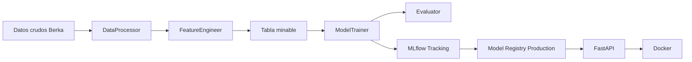

# Informe técnico: Clasificación de clientes del Banco Berka

## 1. Introducción y objetivos

El presente proyecto desarrolla una solución de aprendizaje automático para clasificar clientes del conjunto de datos Banco Berka en dos categorías: **buen cliente** y **mal cliente**. El resultado puede apoyar procesos de evaluación crediticia y asignación de tarjetas, siempre como herramienta de apoyo a la decisión y no como sustituto de la evaluación financiera y normativa.

El problema es relevante porque las entidades financieras deben procesar grandes volúmenes de información y mantener decisiones consistentes, trazables y reproducibles. En este proyecto la variable objetivo no representa fraude observado directamente; representa una etiqueta de comportamiento crediticio construida a partir de ingresos, actividad transaccional, saldo y morosidad. Esta precisión es importante: el modelo implementado es de clasificación de clientes, no un detector supervisado de fraude con etiquetas de fraude.

Los objetivos de ingeniería fueron:

- Versionar datos y modelos pesados con DVC, manteniendo en Git el código, la configuración y los punteros.
- Registrar experimentos, métricas, artefactos y versiones con MLflow Tracking y Model Registry.
- Organizar el código mediante clases con responsabilidades separadas y estilo PEP8.
- Validar transformaciones, API, linaje y ciclo de vida del modelo mediante Pytest.
- Exponer el modelo productivo mediante una API REST con FastAPI y Pydantic.
- Empaquetar el servicio mediante Docker para aislar el entorno de ejecución.

## 1.1 Planteamiento del problema de negocio e ingeniería

El negocio necesita priorizar clientes con características compatibles con un buen comportamiento crediticio. La dificultad técnica consiste en integrar varias tablas relacionadas, resumir transacciones, tratar valores faltantes, convertir variables categóricas, evitar que los identificadores dominen el aprendizaje y comparar modelos con una métrica adecuada.

Se seleccionó F1 como métrica principal porque combina precisión y recall. Esto permite equilibrar dos riesgos: recomendar clientes que posteriormente presenten un comportamiento desfavorable y descartar clientes que sí podrían ser buenos. También se registran Accuracy, ROC-AUC, average precision, precision y recall para observar el comportamiento desde varias perspectivas.

## 2. Descripción del conjunto de datos

El conjunto Banco Berka está compuesto por tablas relacionales de clientes, disposiciones de cuenta, tarjetas, cuentas, préstamos y transacciones. Los archivos crudos se encuentran en formato `.asc` y se leen con separador `;`. El proyecto utiliza las tablas `client`, `disp`, `card`, `account`, `loan` y `trans`.

La integración comienza uniendo clientes con disposiciones y cuentas. Después se agregan variables derivadas de transacciones, préstamos y tarjetas. La salida procesada documentada por el entrenamiento tiene **5.369 registros y 21 columnas**.

### 2.1 EDA, limpieza y selección de variables

Las transformaciones principales son:

1. Agregación de transacciones por cuenta: número total de transacciones y saldo promedio.
2. Agregación de ingresos: suma y cantidad de operaciones `PRIJEM`.
3. Agregación de egresos: suma y cantidad de operaciones `VYDAJ`.
4. Agregación de préstamos: existencia, monto total y señal de morosidad.
5. Agregación de tarjetas por disposición: existencia y tipo de tarjeta.
6. Eliminación de identificadores distritales y duplicados por cliente.
7. Relleno inicial con cero para variables de ausencia, como préstamo o tarjeta.
8. Eliminación de columnas cuya proporción de nulos supera 0,60 e imputación posterior por mediana o moda.
9. Codificación one-hot de `type` y `frequency`.
10. Estandarización de variables cuantitativas mediante `StandardScaler`.

La variable `buen_cliente` se construye como 1 cuando el cliente supera la mediana de ingresos, supera la mediana de transacciones, tiene saldo promedio positivo y no aparece como moroso. En caso contrario toma el valor 0. Esta es una etiqueta heurística, por lo que sus resultados dependen de la regla de negocio elegida.

Las variables usadas por el modelo excluyen el objetivo, los identificadores, variables agregadas empleadas directamente en la definición del objetivo y columnas categóricas no utilizadas en la etapa final. La importancia de las variables se guarda en `reports/importancia_variables.csv` y se visualiza mediante `reports/figures/permutation_importance.png` y `reports/figures/importancia_random_forest.png`.

## 3. Estructura del proyecto y metodología

El proyecto sigue una organización modular inspirada en Cookiecutter Data Science:

- `data/raw`: archivos de entrada originales.
- `data/processed`: tabla minable generada por el preprocesamiento.
- `caso_berka_model`: paquete principal de código.
- `caso_berka_model/modeling`: entrenamiento y predicción.
- `caso_berka_model/mlflow_engine`: tracking, evaluación, artefactos, linaje y registry.
- `caso_berka_model/api`: aplicación FastAPI, esquemas y carga del modelo.
- `models`: modelos serializados y artefacto preparado para Docker.
- `metrics`: métricas y datos para gráficos versionados por DVC.
- `reports`: métricas comparativas, importancia de variables, deciles y figuras.
- `tests`: pruebas unitarias y de integración.
- `dvc.yaml` y `params.yaml`: definición reproducible del pipeline y sus parámetros.

El flujo completo es:

## 4. Control de versiones de datos con DVC

El archivo `dvc.yaml` define dos etapas:

- `preprocess`: ejecuta `python -m caso_berka_model.dataset`, depende de los datos crudos, `dataset.py`, `features.py` y `prepare.null_threshold`, y produce `data/processed/tabla_minable.csv`.
- `train`: ejecuta `python -m caso_berka_model.modeling.train`, depende de los módulos de modelado, gráficos, MLflow y la tabla procesada. Produce `models/best_model.joblib`, `metrics/eval.json` y `metrics/plots.csv`.

La separación Git-DVC evita subir archivos grandes al repositorio. Git conserva código, parámetros, configuración y archivos `.dvc`; DVC conserva datos, modelos y artefactos pesados en el remote local. La reproducción se realiza con `dvc repro`, la recuperación con `dvc pull` y la publicación con `dvc push`.

Esta estrategia permite reconstruir el resultado a partir de una versión del código, los parámetros y el contenido identificado por DVC. El estado de DVC también se incorpora como metadato de linaje en MLflow junto con el commit de Git.

## 5. Desarrollo del modelo: POO y PEP8

La solución aplica separación de responsabilidades:

- `DataProcessor`: localiza, carga y guarda los datos.
- `FeatureEngineer`: ejecuta uniones, agregaciones, limpieza, creación del objetivo, codificación y escalado.
- `ModelTrainer`: carga parámetros, divide los datos, entrena candidatos, selecciona el mejor modelo y coordina los artefactos.
- `Evaluator`: calcula métricas y genera los archivos que consume DVC.
- `Predictor`: genera resultados de predicción y análisis por deciles.
- `MLflowEnterpriseTrainer`: registra ejecuciones padre, ejecuciones anidadas, modelos y artefactos.
- `EnterpriseDecisionWrapper`: adapta el clasificador a PyFunc y aplica los umbrales de decisión.
- `MLflowGovernanceManager`: consulta versiones y promueve el modelo a Production.

Se compararon Regresión Logística balanceada, KNN, Árbol de Decisión y Random Forest. Random Forest usa `class_weight="balanced_subsample"`, 400 estimadores, `min_samples_leaf=3` y semilla 42. KNN selecciona `k` mediante validación cruzada de cinco particiones.

La configuración se centraliza en `params.yaml`; de esta forma, parámetros como la proporción de prueba, semilla, número de árboles, profundidad y métrica de selección no quedan dispersos en el código. El proyecto declara Python 3.11 o superior y configura Ruff con longitud máxima de línea 99 y ordenamiento de imports.

## 6. Gestión de experimentos con MLflow

MLflow usa SQLite como backend local y `mlruns/` para artefactos. El experimento se denomina `Berka_Credit_Classification` y el modelo registrado `Berka_BuenCliente`. Cada entrenamiento crea una ejecución padre y ejecuciones anidadas para los cuatro candidatos. Se registran parámetros, métricas, gráficos ROC, matrices de confusión, firmas de entrada y ejemplos de datos.

El `DataLineage` registra el commit corto de Git y el estado de DVC. El modelo ganador se envuelve como PyFunc con umbral de decisión 0,65 y bandera de alta confianza desde 0,85. La versión se asigna al alias `Production` y, cuando está disponible, también al stage de producción.

### 6.1 Comparación de experimentos/modelos

La comparación guardada en `reports/metricas_modelos.csv` es:

| Modelo | Accuracy | Precision | Recall | F1 | ROC-AUC | Average precision |
|---|---:|---:|---:|---:|---:|---:|
| Regresión Logística | 0,9212 | 0,8741 | 0,8920 | 0,8829 | 0,9752 | 0,9442 |
| KNN | 0,8243 | 0,7352 | 0,7393 | 0,7372 | 0,8861 | 0,7506 |
| Árbol de Decisión | 0,9659 | 0,9547 | 0,9423 | 0,9485 | 0,9600 | 0,9188 |
| **Random Forest** | **0,9808** | **0,9567** | **0,9870** | **0,9716** | **0,9977** | **0,9949** |

Random Forest fue seleccionado por obtener el mayor F1. Sus métricas reproducidas en `metrics/eval.json` son Accuracy 0,9808, Precision 0,9567, Recall 0,9870 y F1 0,9716. El recall alto es favorable cuando interesa reducir la cantidad de buenos clientes omitidos, mientras que la precision indica que la mayoría de las clasificaciones positivas son correctas.

Para las capturas solicitadas, se debe incluir la pantalla de MLflow con: nombre del experimento, run padre, runs anidados, parámetros, métricas y versión `Berka_BuenCliente` en `Production`. Como soporte visual adicional se incluyen:

- `reports/figures/comparacion_metricas.png`
- `reports/figures/roc_comparacion_modelos.png`
- `reports/figures/roc_mejor_modelo.png`
- `reports/figures/ganancia_acumulada.png`
- `reports/figures/permutation_importance.png`
- `reports/figures/importancia_random_forest.png`

## 7. Estrategia de testing

Las pruebas se ejecutan con Pytest y se organizan por contrato:

- `test_data.py` valida la creación de la variable objetivo y la existencia de las clases principales.
- `test_api.py` usa un modelo mock para probar `GET /`, `GET /health` y `POST /predict`, además de los estados sin modelo cargado. También verifica las ocho variables de entrada, el diagnóstico, la probabilidad y los metadatos de versión.
- `test_mlflow.py` valida el linaje, la salida del wrapper PyFunc, el registro de métricas en una base SQLite temporal, el registro del modelo y su promoción a Production.

La batería incluye pruebas unitarias y pruebas de integración aisladas. El uso de datos sintéticos y directorios temporales en MLflow evita depender de la base de tracking real para validar el contrato del componente.

## 8. Productivización con FastAPI

La API se implementa en `caso_berka_model/api/main.py`. El modelo de Production se carga durante el ciclo de vida de la aplicación. Los esquemas Pydantic definen la estructura de entrada y salida, exigiendo al menos un elemento en el arreglo `data`.

Endpoints:

- `GET /`: informa estado, nombre, versión productiva y `run_id`.
- `GET /health`: devuelve estado saludable o HTTP 503 si el modelo no está disponible.
- `POST /predict`: recibe features preprocesadas, ejecuta inferencia y devuelve predicción, diagnóstico, probabilidad, confianza y metadatos del modelo.

El contrato actual requiere ocho features preprocesadas: `birth_number`, `date`, `cantidad_ingresos`, `total_egresos`, `cantidad_egresos`, `tiene_prestamo`, `monto_prestamo` y `tiene_tarjeta`. La documentación interactiva está disponible en `/docs` cuando se ejecuta Uvicorn.

## 9. Contenerización con Docker

El `Dockerfile` utiliza `python:3.11-slim`, instala dependencias y expone el puerto 8000. Docker Compose define el servicio `api`, publica `8000:8000` y configura la ruta del modelo preparado para el contenedor.

El modelo se copia previamente a `models/docker_production` porque las rutas absolutas del Model Registry local no son válidas dentro del contenedor. El flujo recomendado es ejecutar `make docker-build` y después `make docker-run`, o utilizar `docker compose up --build`. El endpoint `/health` sirve como comprobación inicial del contenedor.

## 10. Estrategia Git y trabajo colaborativo

Git debe contener el código fuente, pruebas, documentación, `dvc.yaml`, `params.yaml`, `dvc.lock`, configuración y punteros `.dvc`. Los datos crudos, CSV procesados, modelos Joblib, cachés DVC, tracking local y figuras generadas se mantienen fuera del control de versiones normal mediante `.gitignore` y DVC cuando corresponde.

Una estrategia colaborativa adecuada es trabajar con ramas por funcionalidad, revisar cambios mediante pull requests y mantener commits pequeños que separen datos/configuración, modelado, API y despliegue. Antes de integrar cambios se debe ejecutar `pytest tests`, `ruff check`, `dvc repro` y una comprobación de `/health`. Las métricas y parámetros deben revisarse con `dvc metrics show`, `dvc metrics diff` y `dvc params diff`.

## 11. Conclusiones, limitaciones y propuestas de mejora

El proyecto entrega un flujo MLOps reproducible de extremo a extremo: ingesta, ingeniería de variables, entrenamiento, evaluación, versionado, tracking, registro, API y Docker. Random Forest fue el mejor candidato bajo F1, con 0,9716, y quedó preparado para promoción a Production.

Limitaciones:

- La etiqueta `buen_cliente` es heurística y no una observación directa de fraude, incumplimiento futuro o pérdida financiera.
- El informe no debe interpretar las métricas como evidencia de detección de fraude real.
- El modelo recibe features ya preprocesadas en la API; todavía no existe un endpoint que transforme datos transaccionales crudos.
- La evaluación usa una partición de prueba fija y no documenta intervalos de confianza ni validación temporal.
- La alta precisión observada puede verse afectada por la forma en que se construyó la variable objetivo y por posibles relaciones entre variables predictoras y dicha etiqueta.
- El remote DVC es local; para producción colaborativa convendría usar almacenamiento compartido con controles de acceso y respaldo.

Propuestas de mejora:

1. Definir una etiqueta basada en eventos reales de mora, fraude o pérdida y validarla con expertos del negocio.
2. Usar validación temporal y un conjunto de prueba completamente posterior al período de entrenamiento.
3. Calibrar probabilidades y revisar el umbral 0,65 según el costo de falsos positivos y falsos negativos.
4. Añadir monitoreo de deriva de datos, calidad de entradas, latencia y desempeño posterior al despliegue.
5. Incorporar explicabilidad con SHAP o análisis de contribución de variables, además de controles de sesgo y revisión humana.
6. Separar el preprocesamiento en un pipeline persistente para que la API acepte entradas consistentes y reduzca el riesgo de entrenamiento-servicio divergente.
7. Migrar el tracking y el remote DVC a servicios compartidos en un entorno productivo.

## 12. Bibliografía

- Berka, P. (1999). *The PKDD'99 Discovery Challenge: The Czech Bank Dataset*. PKDD.
- Kuhn, M. y Johnson, K. (2013). *Applied Predictive Modeling*. Springer.
- scikit-learn developers. *scikit-learn User Guide: Classification metrics and model selection*. https://scikit-learn.org/stable/user_guide.html
- DVC. *Data Version Control Documentation*. https://dvc.org/doc
- MLflow. *MLflow Documentation: Tracking, Models and Model Registry*. https://mlflow.org/docs/latest/
- FastAPI. *FastAPI Documentation*. https://fastapi.tiangolo.com/
- Pydantic. *Pydantic Documentation*. https://docs.pydantic.dev/
- Docker. *Docker Documentation*. https://docs.docker.com/
- Nilson Report. (2024). Referencia de pérdidas globales por fraude con tarjetas, citada en el planteamiento inicial. Verificar la edición y página exacta antes de entregar la versión final.
