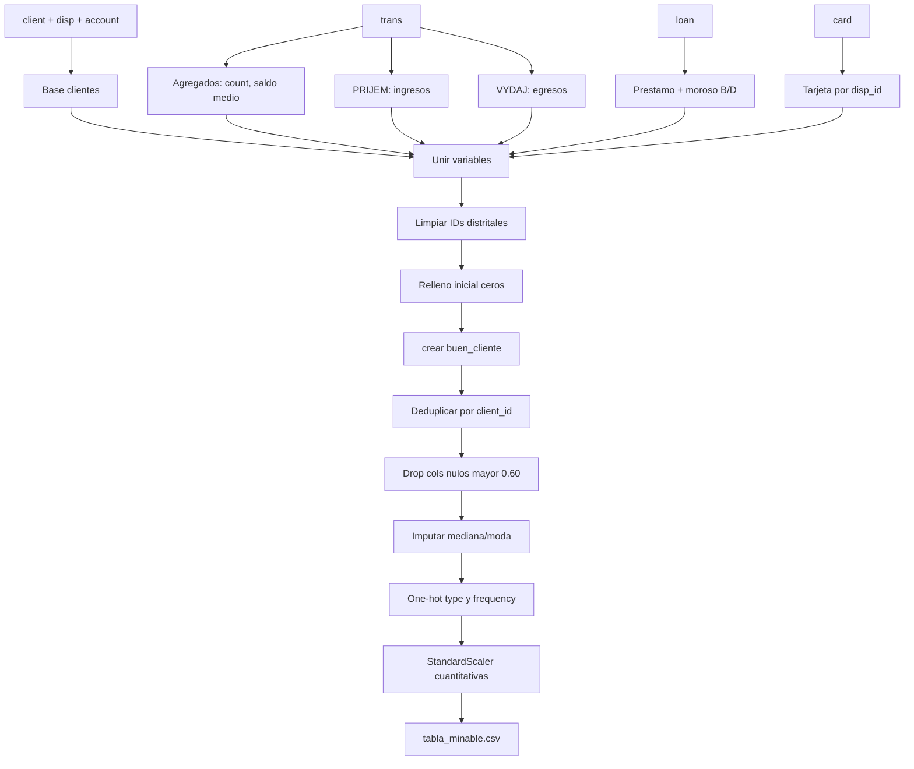

# 2. Descripción del conjunto de datos

## Origen y tablas

El conjunto **Banco Berka** (PKDD'99 Discovery Challenge) está compuesto por tablas relacionales. Los archivos crudos están en formato `.asc` con separador `;`, bajo `data/raw/` (versionados con DVC, no en Git).

| Tabla | Uso en el proyecto |
|-------|--------------------|
| `client` | Identidad del cliente |
| `disp` | Disposición cuenta–cliente |
| `card` | Tarjetas por disposición |
| `account` | Cuentas y frecuencia de emisión |
| `loan` | Préstamos y estado (incl. mora) |
| `trans` | Transacciones (ingresos/egresos, saldos) |

Definidas en `DataProcessor.RAW_TABLES` (`caso_berka_model/dataset.py`).

## Tabla minable

Tras uniones y transformaciones, el entrenamiento documenta:

- **5.369 registros**
- **21 columnas**

Salida: `data/processed/tabla_minable.csv` (artefacto DVC del stage `preprocess`).

## Flujo de limpieza e ingeniería de variables

Implementado en `FeatureEngineer` (`caso_berka_model/features.py`), orquestado por `DataProcessor.clean_data`.

### Transformaciones principales

1. **Transacciones por cuenta**: número total y saldo promedio.
2. **Ingresos** (`type == PRIJEM`): suma y cantidad.
3. **Egresos** (`type == VYDAJ`): suma y cantidad.
4. **Préstamos**: existencia, monto total; `moroso` si `status` ∈ {`B`, `D`}.
5. **Tarjetas** por `disp_id`: existencia y tipo.
6. Eliminación de `district_id_*` y duplicados por `client_id`.
7. Relleno con cero en ausencia de préstamo/tarjeta/agregados.
8. Eliminación de columnas con proporción de nulos **> 0,60** (`prepare.null_threshold` en `params.yaml`) e imputación posterior (mediana / moda).
9. One-hot de `type` y `frequency`.
10. Estandarización de variables cuantitativas con `StandardScaler`.

### Variable objetivo (heurística)

`buen_cliente = 1` cuando se cumplen **todas** estas condiciones; en caso contrario `0`:

- `total_ingresos` > mediana de ingresos
- `total_transacciones` > mediana de transacciones
- `saldo_promedio` > 0
- `moroso == 0`

!!! note "Dependencia de la regla de negocio"
    Los resultados dependen de esta definición heurística. No es una observación directa de mora futura, fraude o pérdida financiera.

## Justificación de selección de variables

### Predictoras usadas por el modelo (8)

Contrato alineado con la API y el PyFunc de Production (`FEATURE_COLUMNS` en `caso_berka_model/api/schemas.py`):

| Feature | Motivación |
|---------|------------|
| `birth_number` | Proxy demográfico del cliente |
| `date` | Fecha asociada a la cuenta / contexto temporal |
| `cantidad_ingresos` | Intensidad de ingresos (no el total usado en el label) |
| `total_egresos` | Volumen de egresos |
| `cantidad_egresos` | Frecuencia de egresos |
| `tiene_prestamo` | Exposición a crédito formal |
| `monto_prestamo` | Intensidad del préstamo |
| `tiene_tarjeta` | Producto tarjeta |

### Columnas excluidas del entrenamiento

En `ModelTrainer.separar_variables` se eliminan, entre otras:

| Grupo | Columnas | Motivo |
|-------|----------|--------|
| Objetivo | `buen_cliente` | Variable a predecir |
| Identificadores | `client_id`, `disp_id`, `account_id` | Evitar aprendizaje espurio / fuga por ID |
| Usadas en el label | `total_ingresos`, `total_transacciones`, `saldo_promedio`, `moroso` | Reducir dependencia directa de la definición del objetivo |
| One-hot no usadas en etapa final | `type_*`, `frequency_*` | No forman parte del contrato de 8 features |

La importancia de variables se guarda en `reports/importancia_variables.csv` y figuras:

- `reports/figures/permutation_importance.png`
- `reports/figures/importancia_random_forest.png`

(Generadas al entrenar; no versionadas en Git por `.gitignore`.)

## Siguiente lectura

- [3. Estructura del proyecto](03-estructura.md)
- [4. DVC](04-dvc.md)
