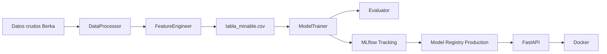
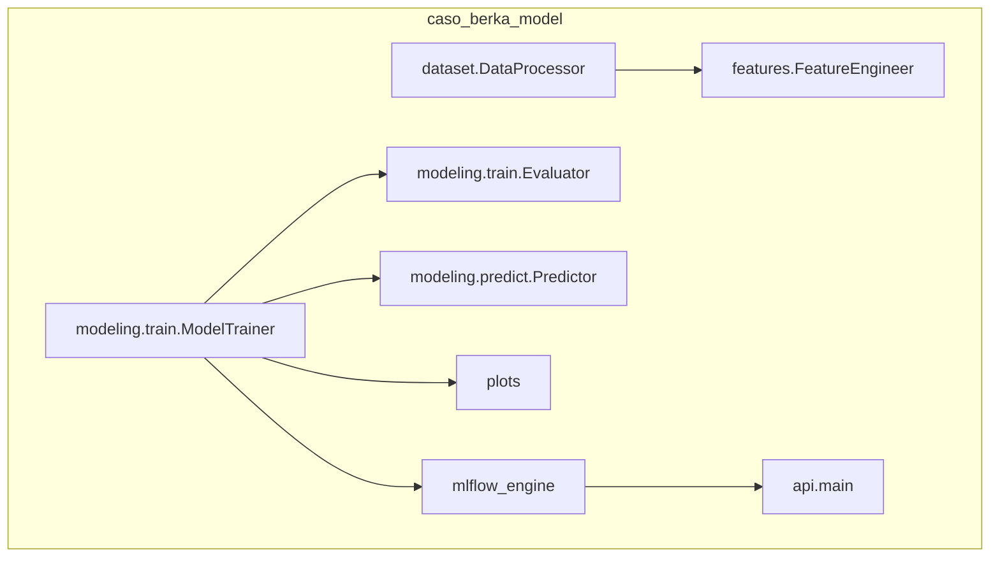

# 3. Estructura del proyecto y metodología

## Estándar de carpetas

El proyecto sigue una organización modular inspirada en **Cookiecutter Data Science**, con un paquete Python instalable `caso_berka_model`.

| Ruta | Rol |
|------|-----|
| `data/raw` | Entrada original (`.asc`), DVC |
| `data/processed` | Tabla minable `tabla_minable.csv` |
| `caso_berka_model/` | Código fuente principal |
| `caso_berka_model/modeling/` | Entrenamiento y predicción |
| `caso_berka_model/mlflow_engine/` | Tracking, evaluación, artefactos, linaje, registry |
| `caso_berka_model/api/` | FastAPI, esquemas Pydantic, carga del modelo |
| `models/` | `best_model.joblib` y `docker_production/` |
| `metrics/` | `eval.json`, `plots.csv` (DVC metrics/plots) |
| `reports/` | Métricas CSV, importancia, deciles, figuras |
| `tests/` | Pytest unitarias e integración |
| `dvc.yaml` / `params.yaml` | Pipeline reproducible y parámetros |
| `docs/` | Esta documentación MkDocs |

## Arquitectura end-to-end

### Capas del sistema

1. **Datos**: ingesta y features → CSV procesado versionado con DVC.
2. **Modelado**: cuatro candidatos; selección por F1; métricas y gráficos.
3. **Gobernanza**: MLflow (runs anidados, PyFunc con umbral, alias `Production`).
4. **Serving**: FastAPI carga Production (local: Registry; Docker: ruta fija).
5. **Empaquetado**: imagen `caso-berka-api` en puerto 8000.

## Metodología de trabajo

| Práctica | Herramienta |
|----------|-------------|
| Reproducibilidad de datos/modelos | DVC (`dvc repro`) |
| Configuración centralizada | `params.yaml` |
| Experimentación | MLflow SQLite + UI |
| Calidad de código | Ruff (PEP8 / isort) |
| Pruebas | Pytest (`make test`) |
| API y contrato | FastAPI + Pydantic |
| Aislamiento de runtime | Docker Compose |

Comandos de entrada habituales: `make data`, `make train`, `make dvc-repro`, `make mlflow-train`, `make api-serve`, `make docker-build`.

## Diagrama de componentes de código

## Siguiente lectura

- [4. Control de versiones con DVC](04-dvc.md)
- [5. POO y PEP8](05-poo-pep8.md)
- [Guía de diapositivas 4–5](slides.md#diapositivas-4-5)
