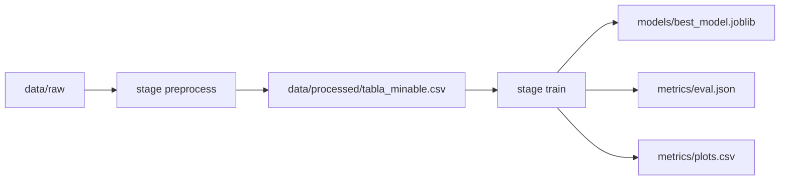

# 4. Control de versiones de datos (DVC)

## Por qué DVC

Los datos crudos, el CSV procesado y el modelo Joblib son **pesados**. Git guarda código, configuración y **punteros**; DVC guarda el contenido de datos/modelos en un remote y deja hashes en archivos `.dvc` / `dvc.lock`.

## Pipeline (`dvc.yaml`)

Dos etapas encadenadas:



### Stage `preprocess`

| Campo | Valor |
|-------|--------|
| Comando | `python -m caso_berka_model.dataset` |
| Dependencias | `dataset.py`, `features.py`, `data/raw` |
| Parámetros | `prepare.null_threshold` |
| Salida | `data/processed/tabla_minable.csv` |

### Stage `train`

| Campo | Valor |
|-------|--------|
| Comando | `python -m caso_berka_model.modeling.train` |
| Dependencias | `train.py`, `predict.py`, `plots.py`, `mlflow_engine/`, tabla procesada |
| Parámetros | `prepare.split_ratio`, `prepare.random_state`, `train.n_estimators`, `train.max_depth`, `train.target_col`, `mlflow.enabled` |
| Salidas | `models/best_model.joblib` |
| Métricas DVC | `metrics/eval.json` (`cache: false`) |
| Plots DVC | `metrics/plots.csv` (plantilla confusion) |

## Remote local

Configuración en `.dvc/config`:

- Remote por defecto: `local_remote`
- URL: `../dvc_storage_remote` (directorio **un nivel arriba** del root del repo)

```bash
mkdir -p ../dvc_storage_remote
dvc pull
dvc push
```

`dvc pull` recupera artefactos del remote; `dvc push` publica los outs locales tras un `dvc repro` exitoso.

## `dvc.lock`

`dvc.lock` es YAML **generado** por DVC al reproducir el pipeline. Debe versionarse en Git, pero **nunca** debe contener marcadores de merge (`<<<<<<<`, `=======`, `>>>>>>>`). Si el archivo queda corrupto, restáuralo desde una versión limpia y ejecuta `dvc repro` para regenerar los hashes.

## Comandos habituales

| Acción | Comando | Qué hace |
|--------|---------|----------|
| Recuperar artefactos | `dvc pull` / `make dvc-pull` | Descarga datos/modelos del remote; no ejecuta Python |
| Reproducir pipeline | `dvc repro` / `make dvc-repro` | Corre stages si cambió algo; actualiza `dvc.lock` |
| Publicar al remote | `dvc push` / `make dvc-push` | Sube outs al remote para el equipo |
| Ver métricas | `dvc metrics show` | Muestra métricas versionadas |
| Diff de métricas/params | `dvc metrics diff`, `dvc params diff` | Compara entre commits |
| Estado | `dvc status` | Indica qué outs están desactualizados |

## Git vs DVC

| Tipo | Git | DVC |
|------|:---:|:---:|
| Código `caso_berka_model/` | Sí | — |
| `params.yaml`, `dvc.yaml`, `dvc.lock` | Sí | — |
| `data/raw.dvc` (puntero) | Sí | — |
| Datos `.asc` / CSV procesado | No | Sí |
| `models/best_model.joblib` | No | Sí |
| `metrics/eval.json`, `metrics/plots.csv` | Sí | (plots/metrics DVC) |
| `mlflow.db`, `mlruns/` | No | — |
| Figuras PNG / reports CSV | No | — |

## Linaje en MLflow

La clase `DataLineage` (`caso_berka_model/mlflow_engine/lineage.py`) adjunta como tags:

- `git_commit` — hash corto de `HEAD`
- `dvc_status` — `synced` o `uncommitted_changes` según `dvc status`

Así un run de MLflow queda anclado a una versión de código + estado del pipeline de datos.

!!! tip "Reconstrucción"
    Con el mismo commit de Git, los mismos `params.yaml` y los artefactos DVC (`dvc pull`), se puede reproducir el resultado con `dvc repro`.

## Siguiente lectura

- [5. POO y PEP8](05-poo-pep8.md)
- [7. Testing](07-testing.md) (validación junto al pipeline)
- [Diapositivas 8–9](slides.md#diapositivas-8-9)
