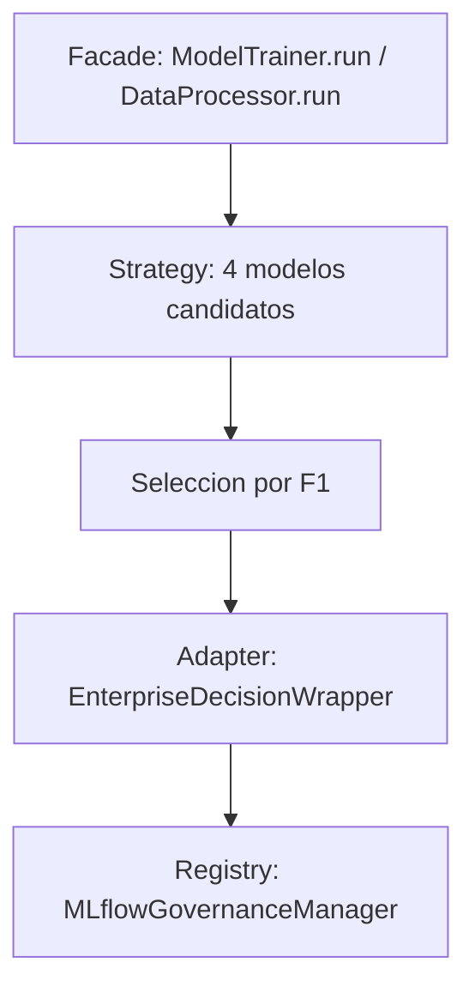

# 5. Desarrollo del modelo: POO y PEP8

## Separación de responsabilidades

El código se organiza en clases con una responsabilidad clara (Single Responsibility), orquestadas por métodos `run()` o módulos de entrada.

| Clase | Módulo | Responsabilidad |
|-------|--------|-----------------|
| `DataProcessor` | `dataset.py` | Localizar `.asc`, cargar, limpiar vía engineer, guardar CSV |
| `FeatureEngineer` | `features.py` | Uniones, agregaciones, objetivo, encoding, escalado |
| `ModelTrainer` | `modeling/train.py` | Params, split, entrenar candidatos, elegir mejor, artefactos |
| `Evaluator` | `modeling/train.py` | Métricas sklearn + `eval.json` / `plots.csv` para DVC |
| `Predictor` | `modeling/predict.py` | Inferencia joblib y tabla de deciles |
| `MLflowEnterpriseTrainer` | `mlflow_engine/trainer.py` | Run padre, nested runs, log de modelos/artefactos |
| `EnterpriseDecisionWrapper` | `mlflow_engine/pyfunc.py` | Adapter PyFunc: umbral 0,65 y flag alta confianza 0,85 |
| `MLflowGovernanceManager` | `mlflow_engine/registry.py` | Versiones, promoción a Production, carga |
| `DataLineage` | `mlflow_engine/lineage.py` | Tags Git/DVC |
| `ArtifactGenerator` | `mlflow_engine/artifacts.py` | Matriz de confusión y ROC para MLflow |
| `AutomatedEvaluator` | `mlflow_engine/evaluator.py` | `mlflow.evaluate` sobre el sklearn base |

## Patrones de diseño aplicados



| Patrón | Uso en el proyecto |
|--------|-------------------|
| **Facade** | `DataProcessor.run()`, `ModelTrainer.run()`, `mlflow_engine.run` ocultan el pipeline |
| **Strategy** | Regresión Logística, KNN, Árbol, Random Forest; misma interfaz de evaluación |
| **Adapter** | `EnterpriseDecisionWrapper` adapta el clasificador a contrato PyFunc (`probability`, `prediction`, `high_confidence_flag`) |
| **Registry** | Promoción y resolución `models:/Berka_BuenCliente@Production` |

## Modelos candidatos

| Modelo | Notas de configuración |
|--------|------------------------|
| Regresión Logística | `class_weight` balanceado, pipeline sklearn |
| KNN | `k` vía CV de 5 folds (`knn_k_max`) |
| Árbol de Decisión | `class_weight` balanceado |
| **Random Forest** | `class_weight="balanced_subsample"`, 400 estimadores, `min_samples_leaf=3`, semilla 42 |

Selección: máximo de la métrica configurada (`selection_metric: F1` en `params.yaml`).

## Estándares de código (PEP8 / Ruff)

En `pyproject.toml`:

- Python **≥ 3.11**
- **Ruff**: `line-length = 99`
- Lint de imports (`extend-select = ["I"]`, isort con `known-first-party = ["caso_berka_model"]`)

```bash
make lint      # ruff format --check && ruff check
make format    # ruff check --fix && ruff format
```

Otras prácticas: type hints en API/MLflow (`from __future__ import annotations`), docstrings de módulo/clase, configuración fuera del código (`params.yaml`).

## Configuración centralizada

Parámetros relevantes en `params.yaml`:

```yaml
prepare:
  split_ratio: 0.30
  random_state: 42
  null_threshold: 0.60

train:
  n_estimators: 400
  max_depth: null
  min_samples_leaf: 3
  selection_metric: F1
  target_col: "buen_cliente"

mlflow:
  enabled: true
  experiment_name: Berka_Credit_Classification
  registered_model_name: Berka_BuenCliente
  decision_threshold: 0.65
```

## Siguiente lectura

- [6. MLflow](06-mlflow.md)
- [Diapositivas 10–11](slides.md#diapositivas-10-11)
