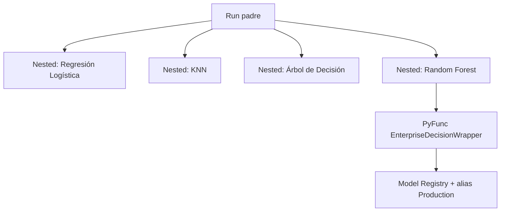

# 6. Gestión de experimentos con MLflow

## Configuración

| Concepto | Valor |
|----------|--------|
| Backend | SQLite local (`mlflow.db`) |
| Artefactos | `mlruns/` |
| Experimento | `Berka_Credit_Classification` |
| Modelo registrado | `Berka_BuenCliente` |
| Umbral de decisión | 0,65 |
| Alta confianza | ≥ 0,85 |
| Alias / stage | `Production` |

Parámetros en `params.yaml` → sección `mlflow.*`. Entrypoint: `python -m caso_berka_model.mlflow_engine.run` / `make mlflow-train`.

## Estructura de un entrenamiento



Cada ejecución registra:

- Parámetros de entrenamiento (sanitizados)
- Métricas: accuracy, precision, recall, f1_score, roc_auc, avg_precision
- Gráficos ROC y matriz de confusión (artefactos)
- Firma de entrada y ejemplos
- Tags de linaje (`git_commit`, `dvc_status`)

El ganador se envuelve como **PyFunc** y se promociona a Production (`MLflowGovernanceManager`).

## Comparación de modelos

Tabla guardada en `reports/metricas_modelos.csv` (valores del informe):

| Modelo | Accuracy | Precision | Recall | F1 | ROC-AUC | Avg precision |
|--------|---------:|----------:|-------:|---:|--------:|--------------:|
| Regresión Logística | 0,9212 | 0,8741 | 0,8920 | 0,8829 | 0,9752 | 0,9442 |
| KNN | 0,8243 | 0,7352 | 0,7393 | 0,7372 | 0,8861 | 0,7506 |
| Árbol de Decisión | 0,9659 | 0,9547 | 0,9423 | 0,9485 | 0,9600 | 0,9188 |
| **Random Forest** | **0,9808** | **0,9567** | **0,9870** | **0,9716** | **0,9977** | **0,9949** |

**Selección:** Random Forest por mayor **F1** (0,9716). Reproducido en `metrics/eval.json`.

### Lectura de negocio

- **Recall alto (0,9870):** reduce buenos clientes omitidos.
- **Precision (0,9567):** la mayoría de positivos predichos son correctos bajo la etiqueta heurística.
- **ROC-AUC ~0,998:** fuerte discriminación en el conjunto de prueba; interpretar con cautela por la construcción del label (ver limitaciones en INFORME).

## UI y comandos

```bash
make mlflow-train
make mlflow-ui
# http://127.0.0.1:5000  --backend-store-uri sqlite:///mlflow.db
```

## Capturas recomendadas para la entrega

Colocar PNG en [`assets/`](assets/README.md) (esta carpeta de docs) o adjuntar en la presentación:

| # | Pantalla | Qué debe verse |
|---|----------|----------------|
| 1 | Lista de experimentos | Nombre `Berka_Credit_Classification` |
| 2 | Run padre | Parámetros, métricas agregadas, tags de linaje |
| 3 | Runs anidados | Los cuatro candidatos con F1 comparables |
| 4 | Artefactos | ROC / confusion bajo `charts/` |
| 5 | Model Registry | `Berka_BuenCliente` versión con alias **Production** |

### Figuras de soporte (generadas al entrenar)

Rutas bajo `reports/figures/` (ignoradas por Git; regenerar con `make train`):

- `comparacion_metricas.png`
- `roc_comparacion_modelos.png`
- `roc_mejor_modelo.png`
- `ganancia_acumulada.png`
- `permutation_importance.png`
- `importancia_random_forest.png`

!!! tip "Placeholder en diapositivas"
    Si aún no tienes capturas de la UI, deja un recuadro “Captura MLflow UI — Production” y completa tras `make mlflow-ui`.

## Siguiente lectura

- [7. Testing](07-testing.md) — tests del wrapper y del registry
- [Diapositivas 6–7](slides.md#diapositivas-6-7)
