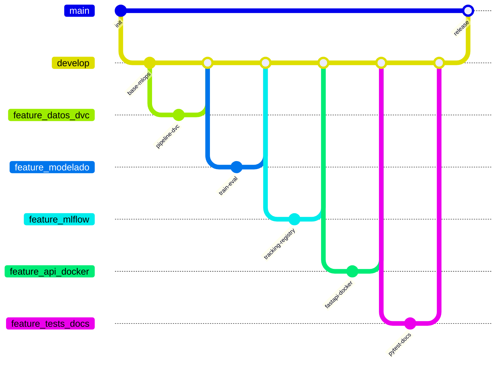

# 10. Estrategia Git y trabajo colaborativo

## Qué versionar en Git

| Incluir en Git | Excluir (`.gitignore` / DVC) |
|----------------|------------------------------|
| Código `caso_berka_model/`, `tests/` | `data/raw/**/*.asc`, CSV de datos |
| `dvc.yaml`, `params.yaml`, `dvc.lock`, `*.dvc` | `models/*.joblib`, `models/docker_production/` |
| `metrics/eval.json`, `metrics/plots.csv` | `mlflow.db`, `mlruns/`, `mlartifacts/` |
| Docs, Makefile, Dockerfile, Compose | `reports/figures/*.png`, reports CSV |
| Config Ruff / `pyproject.toml` | `.venv/`, `.dvc/cache/` |

Regla práctica: **Git** = código + config + punteros; **DVC** = datos y modelos pesados.

## Flujo de ramas (GitFlow)



| Rama | Uso |
|------|-----|
| `main` | Versiones estables / entregas |
| `develop` | Integración continua del equipo |
| `feature/*` | Una capacidad (datos, modelo, API, …) |
| `hotfix/*` | Parches urgentes desde `main` |

Práctica: PRs hacia `develop`, commits pequeños por área, revisión antes de merge.

## Aportación por área (Team 8)

El informe no asigna commits nominativos. La matriz siguiente mapea **módulos del repositorio** a roles colaborativos típicos del equipo listado en el README (cualquier integrante puede haber tocado más de un área):

| Área del repo | Contenido principal | Integrantes (referencia de equipo) |
|---------------|---------------------|--------------------------------------|
| Datos / DVC | `dataset.py`, `features.py`, `dvc.yaml`, `data/raw.dvc` | Ayala Torrico Adriana Nicole · Poma Limache Alisson Daniela |
| Modelado | `modeling/`, `plots.py`, `params.yaml` (train) | Fuentes Rios Beatriz · Vargas Orellana José Roberto |
| MLflow | `mlflow_engine/`, `MLproject` | Peralta Fernández Ismael · Vargas Orellana José Roberto |
| API / Docker | `api/`, `Dockerfile`, `docker-compose.yml` | Peralta Fernández Ismael · Fuentes Rios Beatriz |
| Tests / Docs | `tests/`, `docs/`, `INFORME.md` | Poma Limache Alisson Daniela · Ayala Torrico Adriana Nicole |

Ajustar la matriz en la presentación si el equipo documentó otra división real de tareas.

## Checklist antes de integrar

```bash
pytest tests
ruff check
dvc repro
dvc metrics show
dvc metrics diff HEAD
dvc params diff
# Si afecta serving:
make api-serve   # o docker-run → GET /health
```

## Siguiente lectura

- [Guía de diapositivas 10–11](slides.md#diapositivas-10-11)
- [Inicio](index.md)
